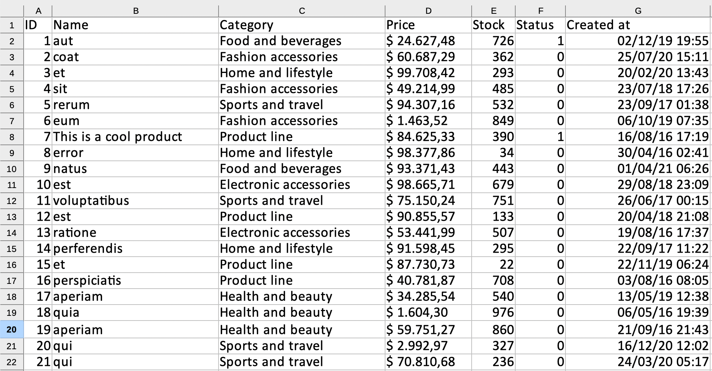

<div align="center">
	<p></p>
</div>

------

# Livewire PowerGrid

## What is Livewire PowerGrid?

[Livewire](https://laravel-livewire.com) PowerGrid is a component for  generating dynamic tables with your Laravel Models.

PowerGrid comes with a variety of out-of-the-box features:

✅ **Searching & Filters**

✅ **Column Sorting**

✅ **Pagination**

✅ **Action checkboxes**

✅ **Action buttons**

✅ **Toggle button**

✅ **Click to edit**

✅ **Click to copy**

✅ **Link on table cell**

✅ **Data Export to XLSx/Excel**

✅ **Works with Bootstrap or Tailwind CSS**

---

# Get started

- [Requirements](#requirements)
- [Installation](#installation)
- [Configuring and Customizing](#configuring-and-customizing)
    - [setUp() Method](#setup-method)
    - [dataSource() Method](#datasource-method)
      - [Column Settings](#column-settings)
      - [Column Filters](#column-filters)
      - [Column Actions](#column-actions)
      - [Action Methods](#action-methods)
- [Examples](#examples)
- [Support](#support)
- [Contributors](#contributors)
- [Credits](#credits)

---

## Requirements

- [Laravel 8x](https://laravel.com/docs/8.x/installation)
- [Livewire 2x](https://laravel-livewire.com)
- Tailwind or bootstrap:
    - [Install Tailwindcss](https://tailwindcss.com/docs/guides/laravel)
    - [Install Bootstrap 5](https://getbootstrap.com/docs/5.0/getting-started/introduction/)

## Installation

This documentation will describe the creation of a table called `ProductTable` used to list products of the `Product` Model.

### 1. Via composer

To install via composer, run:

```bash
  composer require power-components/livewire-powergrid dev-main
```

### 2. Publish Config files

Publish the Livewire PowerGrid configuration file with the following command:

```bash
    php artisan vendor:publish --tag=livewire-powergrid-config
```

### 3. Publish files [OPTIONAL] 

This step is OPTIONAL. Skip it if you don't need to customize Livewire PowerGrid.

Language files can be published with:

Views:

```bash
    php artisan vendor:publish --tag=livewire-powergrid-views
```

Language files can be published with:

```bash
    php artisan vendor:publish --tag=livewire-powergrid-lang
```

### 4. Configure the theme

By default, PowerGrid uses Tailwind.

This configuration can be changed in the file `config/livewire-powergrid.php`.

For Bootstrap 5 use:

```php
    //...
    'theme' => 'bootstrap'

```

For Tailwind use:

```php
    //...
    'theme' => 'tailwind'

```

### 5. Include PowerGrid component

Include the Livewire and the PowerGrid styles and scripts:

```html

<head>
...
    <!-- Styles -->
    @livewireStyles
    @powerGridStyles
```

Make sure you have Livewired included too:

```html
...
    <!-- Scripts -->
    @livewireScripts
    @powerGridScripts
</body>
```

You can read more about this at the official [Livewire documentation](https://laravel-livewire.com/docs/2.x/quickstart)

---

### 6.  Creating a Table Component

To create a Table Component run `powergrid:create` informing your table `name` and your `model`.

Example:

```bash
php artisan powergrid:create ProductTable --model="App\Models\Product" 
```

(It's advisable to use "" around your `--model` option)

### 6.1 Create with Fillable 

If your Model has the fillable property specified, use `--fillable` option to create columns based on its value.

```bash
php artisan powergrid:create ProductTable --model="App\Models\Product" --fillable
```

If everything was successful, you will find your new table component inside the `app/Http/Livewire` folder.

### 6.2 Create options

 The command `powergrid:create` accepts the following options:

| Option | Description | Example |
|----|----|----|
|**--model**| Full model path | ```--model="App\Models\Product"``` |
|**--publish**| Publish stubs file into the path 'stubs' | ```--publish``` |
|**--fillable**| Creates columns based on the Model's Fillable array | ```--fillable``` |
|**--template**| Uses a provided stub file as template for creating tables | ```--template=stubs/table_with_buttons.sub``` |

### 7.  Using your Table Component

The `ProductTable` component can be included in any view.

There are two ways to do that. Both work in the same way:

```html
    <livewire:product-table/>
```

or

```html
  @livewire('product-table')
```

---

## Configuring and Customizing

You can configure and customize your table component to adjust it to your needs.

You can view more functionalities consulting each of the following methods:

- [setUp()](#setup-method)
- [dataSource()](#datasource-method)
- [Column Methods](#column-methods)
- [Action Methods](#action-methods)

Here we provide a full example:

```php
    class ProductTable extends PowerGridComponent
    {
        use ActionButton;

        public function setUp()
        {
            $this->showCheckBox()
                ->showPerPage()
                ->showSearchInput();
        }
    
        public function dataSource(): array
        {
            $model = Product::query()->with('group')->get();
            return PowerGrid::eloquent($model)
                ->addColumn('id')
                ->addColumn('name')
                ->addColumn('price_formatted', function(Product $model) {
                    return  '$ ' . number_format($model->price, 2, ',', '.');
                })
                ->addColumn('created_at_formatted', function(Product $model) {
                    return Carbon::parse($model->created_at)->format('d/m/Y H:i:s');
                })
                ->make();
        }
    
        public function columns(): array
        {
            return [
                Column::add()
                    ->title('ID')
                    ->field('id')
                    ->searchable()
                    ->sortable(),
    
                Column::add()
                    ->title(__('Name'))
                    ->field('name')
                    ->searchable()
                    ->sortable(),

                Column::add()
                    ->title(__('Price'))
                    ->field('price_formatted')
                    ->hidden(),
    
                Column::add()
                    ->title(__('Creation date'))
                    ->field('created_at_formatted')
                    ->makeInputDatePicker('created_at')
                    ->searchable()
            ];
        }
    
        public function actions(): array
        {
            return [
                Button::add('edit')
                    ->caption(__('Edit'))
                    //->class('btn btn-primary') //bootstrap example
                    ->class('rounded border-indigo-500 bg-indigo-500 text-white')
                    ->route('product.edit', ['product' => 'id']),
    
                Button::add('destroy')
                    ->caption(__('Delete'))
                    //->class('btn btn-danger') //bootstrap example
                    ->class('rounded border-red-500 bg-red-500 text-white')
                    ->route('product.destroy', ['product' => 'id'])
                    ->method('delete'),
            ];
        }
    }

```

### setUp() Method

The Setup method is used to configure your component.

| Method | Arguments | Description | Example |
|----|----|----|----|
|**showCheckBox**|-|Displays checkboxes on the table|`->showCheckBox()`|
|**showPerPage**|*int* $perPage|Items per page (Default 10) |`->showPerPage()`|
|**showSearchInput**|-|Shows the search input |`->showSearchInput()`|
|**showRecordCount**|*str* Min/Short/Full|Displays the records count|`->showRecordCount('short')`|

```php
  public function setUp()
  {
      $this->showCheckBox()
      ->showRecordCount('short')
      ->showPerPage()
      ->showSearchInput();
  }
```

### dataSource() Method

The `dataSource()` method is responsible for feeding data to your table.

It expects a model collection in the variable `$model`. Relationships can also be included.

Example:

```php
 $model = Product::query()->with('group')->get();
```

Here `$model` is receiving all products with the relationship to groups.

For instance, the product "Mouse" belongs to "Computer" group,  the product "A4 Paper" belongs to "Office Supplies" group.

| Method | Arguments | Description | Example |
|----|----|----|----|
|**addColumn**| *String* $title, *\Closure*  $closure|Database field for this column |`->addColumn('id')`|
|**make**|-|Makes the table |`->make()`|

Example of usage:

```php
return PowerGrid::eloquent($model)
  ->addColumn('id')
  ->addColumn('name')
  ->addColumn('price')
  ->addColumn('price_formatted', function(Product $model) {
      return  '$ ' . number_format($model->price, 2, ',', '.');
    })
    ->addColumn('group_id', function (Product $product) {
        return  $product->group_id;
    })
  ->make();
```

The data of each column can be manipulated with a closure function.

```php
  ->addColumn('price')
//will output 1500.00
```

The example below brings the price formated.

```php
  ->addColumn('price_formatted', function(Product $model) {
      return  '$ ' . number_format($model->price, 2, ',', '.');
    })
//will output $1.500,00
```

The column `group_id` is added for the relationship filter.

```php
    ->addColumn('group_id', function (Product $product) {
        return  $product->group_id;
    })
```

---

#### Column Settings

These are the methods available on each column added with `Column` class.

| Method | Arguments | Result | Example |
|----|----|----|----|
|**add**| |Add a new column |```Column::add()```|
|**field**| *String* $field | Field name| ```->field('name')```|
|**title**| *String* $title |Column title for the given field |```->title('Client Name')```|
|**searchable**| |Includes the column in the global search | ```->searchable()``` |
|**sortable**| |Includes column in the sortable list | ```->sortable()``` |
|**hidden**| |hides the column in the table|```->hidden()```|
|**headerAttribute**|[*String* $class default: ''], [*String* $style default: '']|Add the class and style elements to the column header|```->headerAttribute('text-center', 'color:red')```|
|**bodyAttribute**|[*String* $class default: ''], [*String* $style default: '']|Add the column lines the class and style elements|```->bodyAttribute('text-center', 'color:red')```|
|**visibleInExport**| |When true it will be invisible in the table and will show the column in the exported file|```->visibleInExport(true)```|

#### Column Filters

These are the filters availables for each column.

| Method | Arguments | Result | Example |
|----|----|----|----|
|**makeInputText**| *String* $data_field | Renders a textfield filter for the column|```->makeInputText()```|
|**makeInputDatePicker**| [*String* $class default: 'col-3'] |Include a specific field on the page to filter between the specific date in the column|```->makeInputDatePicker()```|
|**makeInputSelect**| [*Array* $data_source, *String* $display_field, *String* $relation_id, *Array* $settings] |Include a specific field on the page to filter a hasOne relation in the column|```->makeInputSelect(Group::all(), 'name', 'group_id', ['live_search' => true ,'class' => ''])```|
|**makeInputMultiSelect**| $data_source, *String* $display_field, *String* $relation_id |Include a specific field on the page to filter a hasOne relation in the column|```->makeInputSelect(Group::all(), 'name', 'group_id'])```|
|**makeInputRange**| [*string* $data_field, *String* $thousands, *String* $decimal] |Generates a min and max input for range filter.|```->makeInputRange('price', '.', ',')```|


#### Column Actions

These are the actions availables for each column.

| Method | Arguments | Result | Example |
|----|----|----|----|
|**editOnClick**|*bool* $isEditable| Allows the column to be editable by clicking on it (*\*requires Alpine.js*) |```->field('name')->editOnClick()```|
|**toggleable**|*bool* $isTogglable| Renders a toggle control (ON/OFF) (*\*requires Alpine.js*) |```->field('is_active')->toggleable()```|
|**clickToCopy**|*bool* $hasPermission, *string* $label| Renders a button for copying the cell contents |```->field('name')->clickToCopy()```|

Example of usage:

The example bellow will render a column for the attribute name, with the title "Client Name". This column will be searchable by the main search field, will allow editing the values on click, and have its own input box filter on top.

```php
    $canEdit = true; // this role has permission to edit

    Column::add()
        ->title(__('Client Name'))
        ->field('name')
        ->searchable()
        ->editOnClick($canEdit)
        ->clickToCopy()
        ->makeInputText()
        ->sortable(),
```

The next example will bring a column with the date formatted and with a date filter for it.

```php
  Column::add()
      ->title('Creation date')
      ->field('created_at_formatted')  //Display formatted data dd/mm/YYY to the user
      ->makeInputDatePicker('created_at') //Uses unformatted data
      ->searchable()
```

The example bellow renders a min-max amount filter and configures it to handle the custom currency formatting ($ 85.133,84). The method `makeInputRange` references the `price` atrribute, while the column outputs the `price_formatted`.

```php
  Column::add()
      ->title(__('US Price'))
      ->field('price_formatted')
      ->makeInputRange('price', '.', ','),

```

**NOTE** 

To use some features you must include Alpine.js before the `<body>` tag.

Example with CDN:

```php
//...
@powerGridScripts
@livewireScripts

<script src="https://cdn.jsdelivr.net/gh/alpinejs/alpine@v2.x.x/dist/alpine.min.js" defer></script>
```

It's also required to have the update() method active and configured.

Example of usage:


```php
public function update(array $product): bool
{
      try {
          $updated = Product::query()->find($product['id'])->update([
              $product['field'] => $product['value']
          ]);
      } catch (QueryException $exception) {
          $updated = false;
      }
      return $updated;
}
```

The `update()` method supports custom messages for each field.

To modify the displayed message after saving data, edit or add items on the `updateMessages()` method.

```php
    public function updateMessages(string $status, string $field = '_default_message'): string
    {
        $updateMessages = [
            'success'   => [
            '_default_message' => __('Data has been updated successfully!'),
             //...
            'name' => __('Product updated successfully!'), // Custom message for name field
            ],

            "error" => [
                '_default_message' => __('Error updating the data.'),
                //'custom_field' => __('Error updating custom field.'),
            ]

        ];

        return ($updateMessages[$status][$field] ?? $updateMessages[$status]['_default_message']);
    }
```
---

### Action Methods

These methods are available on `Button` class.

| Method | Arguments | Result | Example |
|----|----|----|----|
|**add**| *String* $action |Action name |```Button::add()```|
|**caption**| *String* $caption |Label for the button |```->caption('Edit Product')```|
|**class**| *String* $class_attr |CSS class attribute |```->class('bg-indigo-500 text-white')```|
|**method**| *String* $method|Method for action (GET/POST/PUT/DELETE))|```->method('delete')```|
|**route**| *String* $route, *Array*  $param|Route for action|```->route('product.edit', ['product' => 'id'])```|

Example of usage

```php
 return [
    Button::add('destroy')
        ->caption(__('Delete'))
        ->class('btn btn-danger')
        ->route('product.destroy', ['product' => 'id'])
        ->method('delete'),
  //...
];
  ```

  ---
  
## Examples

Tailwind table

 

Excel export

 

## Support

If you need any support, please check our [Issues](https://github.com/Power-Components/livewire-powergrid/issues). You can ask questions or report problems there.

## Contributors

Created by: [Luan Freitas](https://github.com/luanfreitasdev)

Contributors (in alphabetical order):

- [@Claudio Pereira](https://github.com/cpereiraweb)
- [@DanSysAnalyst](https://github.com/dansysanalyst)
- [@Mateus Guimarães](https://github.com/mateusjatenee)
- [@Tiago Braga](https://github.com/Tiagofv)

## Credits

- [Contributions](https://github.com/Power-Components/livewire-powergrid/pulls)
- [Online Logomaker](https://onlinelogomaker.com/logomaker/?project=50439167)
- [Admin Template](https://www.tailwindtoolbox.com/templates/admin-template) used in example screenshot.