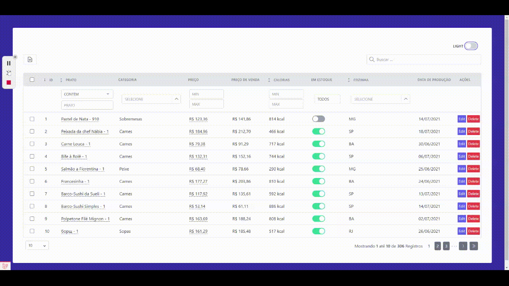

	

    

        <a href="https://livewire-powergrid.docsforge.com/" target="_blank">&#129146; Visit the Documentation &#129144;</a>  
        
        
        
    

------

# Livewire PowerGrid

## What is Livewire PowerGrid?

[Livewire](https://laravel-livewire.com) PowerGrid is a component for  generating dynamic tables with your Laravel Models.

PowerGrid comes with a variety of features:

✅ **Searching & Filters**

✅ **Column Sorting**

✅ **Pagination**

✅ **Action checkboxes**

✅ **Action buttons**

✅ **Toggle button**

✅ **Click to edit**

✅ **Click to copy**

✅ **Link inside a table cell**

✅ **Livewire Modal Integration ([Livewire UI](https://github.com/livewire-ui/modal))**

✅ **Data Export to XLSX/CSV ([Spout](https://github.com/box/spout))**

✅ **Works with Bootstrap 5 or Tailwind CSS 2**

✅ **Translations available for 🇺🇸 🇧🇷 🇪🇸 🇮🇹 🇩🇪 and more to come...**

------

# Get started

## 1. Requirements

- [Laravel 8x](https://laravel.com/docs/8.x/installation)
- [Livewire 2x](https://laravel-livewire.com)
- [Tailwind](https://tailwindcss.com/docs/guides/laravel) or [Bootstrap 5](https://getbootstrap.com/docs/5.0/getting-started/introduction/)

## 2. Documentation

Our documentation is available at [https://livewire-powergrid.docsforge.com/](https://livewire-powergrid.docsforge.com/).

## 3. Example

 

## 4. Demo

 - [Demo project](https://github.com/Power-Components/powergrid-demo) created for a live at [Beer and Code](https://www.youtube.com/watch?v=Mml5aagMOm4&ab_channel=BeerandCode) Youtube channel.

## 5. Support

For questions, issues, bug reports and feature requests, please use our [Issues](https://github.com/Power-Components/livewire-powergrid/issues).

Before submiting a new request, please look into our previous issues.

Verify if your bug/question or feature request has been previously submitted.

## 6. How to contribute

🇺🇸 [How to contribute to PowerGrid](https://github.com/Power-Components/como-contribuir-com-o-powergrid/blob/main/README-EN.md) - Translation by [@DanSysAnalyst](https://github.com/DanSysAnalyst)

🇧🇷 [Guia para contribuir com o Powergrid](https://github.com/Power-Components/como-contribuir-com-o-powergrid/) - by [Claudio Pereira](https://github.com/cpereiraweb)

## 7. Credits

Created by: [Luan Freitas](https://github.com/luanfreitasdev)

- [Contributions](../../contributors)
- Logo & artwork by [Caneco](https://github.com/caneco)