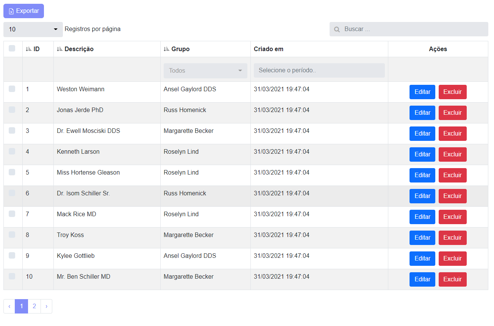
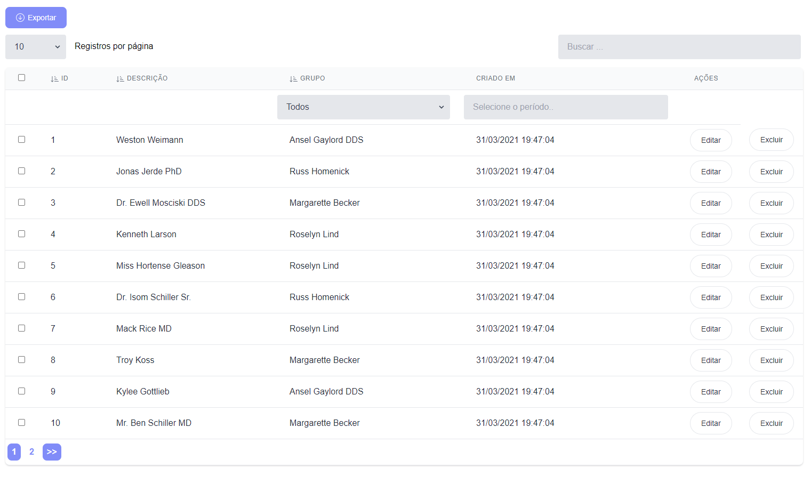

<div align="center">
	<p></p>
</div>

------

# Livewire PowerGrid

## What is Livewire PowerGrid?

PowerGrid is a component for [Laravel Livewire](https://laravel-livewire.com) used to generate dynamic tables for your Laravel Models.

It provides out of the box:


✅ **Searching & Filters**

✅ **Column Sorting**

✅ **Pagination**

✅ **Action checkboxes**

✅ **Action buttons**

✅ **Toggle button**

✅ **Click to edit**

✅ **Link on table cell**

✅ **Data Export to XLSx/Excel**

✅ **Works with Bootstrap or Tailwind CSS**

---

# Get started

- [Requirements](#requirements)
- [Installation](#installation)
- [Configuring and Customizing](#configuring-and-customizing)
    - [setUp() Method](#setup-method)
    - [dataSource() Method](#datasource-method)
    - [Column Methods](#column-methods)
    - [Action Methods](#action-methods)
- [Examples](#examples)
- [Support](#support)
- [Contributors](#contributors)
- [Credits](#credits)

---


## Requirements

- [Laravel 8x](https://laravel.com/docs/8.x/installation)
- [Livewire 2x](https://laravel-livewire.com)
- Tailwind or bootstrap:
    - [Install Tailwindcss](https://tailwindcss.com/docs/guides/laravel)
    - [Install Bootstrap 5](https://getbootstrap.com/docs/5.0/getting-started/introduction/)


## Installation

For the instalation guide we will create a `ProductTable` to list  products of a `Product` Model.

### 1. Via composer

To install via composer, run the following command:

```bash
  composer require power-components/livewire-powergrid dev-main
```

### 2. Publish Config files

You can publish the Livewire PowerGrid configuration file with the following command:

```bash
    php artisan vendor:publish --tag=livewire-powergrid-config
```

### 3. Publish files [OPTIONAL] 

This step is OPTIONAL. You may skip it if you don't need to customize Livewire PowerGrid.

Livewire PowerGrid can publish its views and language files using the following commands:

Views:

```bash
    php artisan vendor:publish --tag=livewire-powergrid-views
```

Language files:

```bash
    php artisan vendor:publish --tag=livewire-powergrid-lang
```

### 4. Change the theme of your choice in config/livewire-powergrid.php

For Tailwind

```php
    //...
    'theme' => 'tailwind'

```

For Bootstrap 5

```php
    //...
    'theme' => 'bootstrap'

```


### 5. Include PowerGrid component

```html
    @powerGridStyles and @powerGridScripts
```

Make sure you have Livewired included too:

```html
    @livewireStyle and @livewireScripts
```

You can read more about this at the official [Livewire documentation](https://laravel-livewire.com/docs/2.x/quickstart)

---

### 6.  Creating a Table Component

To create a Table Component for an entity use the following Artisan command.

(It's advisable to use "" around your `--model` option)

```bash
php artisan powergrid:create ProductTable --model="App\Models\Product" 
```


If everything was succesfull, you will find your new table component inside the `app/Http/Livewire` folder.

### Options

| Option | Description | Example | 
|----|----|----|
|**--model**| Full model path | ```--model="App\Models\Product"``` |
|**--publish**| Publish stubs file into the path 'stubs' | ```--publish``` |
|**--fillable**| Creates columns based on the Model's Fillable array | ```--fillable``` |
|**--template**| Uses a provided stub file as template for creating tables | ```--template=stubs/table_with_buttons.sub``` |

### 7.  Using your Table Component

The `ProductTable` component can be included in any view.

There are two ways to do that. Both work in the same way:

```html
    <livewire:product-table/>
```

or

```html
  @livewire('product-table')
```

---

## Configuring and Customizing


You can configure and customize your table component to adjust it to your needs.

You can view more functionalities consulting each of the following methodos:

- [setUp()](#setup-method)
- [dataSource()](#datasource-method)
- [Column Methods](#column-methods)
- [Action Methods](#action-methods)

Here we provide a full example:

```php
    class ProductTable extends PowerGridComponent
    {
        use ActionButton;

        public function setUp()
        {
            $this->showCheckBox()
                ->showPerPage()
                ->showSearchInput();
        }
    
        public function dataSource(): array
        {
            $model = Product::query()->with('group')->get();
            return PowerGrid::eloquent($model)
                ->addColumn('id')
                ->addColumn('name')
                ->addColumn('price_formatted', function(Product $model) {
                    return  '$ ' . number_format($model->price, 2, ',', '.');
                })
                ->addColumn('created_at_formatted', function(Product $model) {
                    return Carbon::parse($model->created_at)->format('d/m/Y H:i:s');
                })
                ->make();
        }
    
        public function columns(): array
        {
            return [
                Column::add()
                    ->title('ID')
                    ->field('id')
                    ->searchable()
                    ->sortable(),
    
                Column::add()
                    ->title(__('Name'))
                    ->field('name')
                    ->searchable()
                    ->sortable(),

                Column::add()
                    ->title(__('Price'))
                    ->field('price_formatted')
                    ->hidden(),
    
                Column::add()
                    ->title(__('Creation date'))
                    ->field('created_at_formatted')
                    ->makeInputDatePicker('created_at')
                    ->searchable()
            ];
        }
    
        public function actions(): array
        {
            return [
                Button::add('edit')
                    ->caption(__('Edit'))
                    ->class('btn btn-primary')
                    ->route('product.edit', ['product' => 'id']),
    
                Button::add('destroy')
                    ->caption(__('Delete'))
                    ->class('btn btn-danger')
                    ->route('product.destroy', ['product' => 'id'])
                    ->method('destroy'),
            ];
        }
    }
```

### setUp() Method

The Setup method is used to configure your component.


| Method | Arguments | Description | Example |
|----|----|----|----|
|**showCheckBox**|-|Displays checkboxes on the table|`->showCheckBox()`|
|**showPerPage**|*int* $perPage|Items per page (Default 10) |`->showPerPage()`|
|**showSearchInput**|-|Shows the search input |`->showSearchInput()`|

```php
  public function setUp()
  {
      $this->showCheckBox()
      ->showPerPage()
      ->showSearchInput();
  }
```


### dataSource() Method

The `dataSource()` method is responsible for feeding data to your table.

It expects a model collection in the variable `$model`. Relationships can also be included.

Example:

```php
 $model = Product::query()->with('group')->get();
```

Here `$model` is receiving all products with the relationship to groups.

For instance, the product "Mouse" belongs to "Computer" group,  the product "A4 Paper" belongs to "Office Supplies" group. 


| Method | Arguments | Description | Example |
|----|----|----|----|
|**addColumn**| *String* $title, *\Closure*  $closure|Database field for this column |`->addColumn('id')`|
|**make**|-|Makes the table |`->make()`|


Example of usage:

```php
return PowerGrid::eloquent($model)
  ->addColumn('id')
  ->addColumn('name')
  ->addColumn('price')
  ->addColumn('price_formatted', function(Product $model) {
      return  '$ ' . number_format($model->price, 2, ',', '.');
    })
  ->make();
```

The data of each column can be manipulated with a closure function.

```php
  ->addColumn('price')
//will output 1500.00
```

The example bellow brings the price formated.

```php
  ->addColumn('price_formatted', function(Product $model) {
      return  '$ ' . number_format($model->price, 2, ',', '.');
    })
//will output $1.500,00
```
                                                                                                                                                                                                                                                  

---

### Column Methods


These are the methods available on each column added with `Column` class.

| Method | Arguments | Result | Example |
|----|----|----|----|
|**add**| |Add a new column |```Column::add()```|
|**field**| *String* $field | Field name| ```->field('name')```|
|**title**| *String* $title |Column title for the given field |```add()->title('Client Name')```|
|**searchable**| |Includes the column in the global search | ```->searchable()``` |
|**sortable**| |Includes column in the sortable list | ```->sortable()``` |
|**hidden**| |hides the column in the table|```->hidden()```|
|**headerAttribute**|[*String* $class default: ''], [*String* $style default: '']|Add the class and style elements to the column header|```->headerAttribute('text-center', 'color:red')```|
|**bodyAttribute**|[*String* $class default: ''], [*String* $style default: '']|Add the column lines the class and style elements|```->bodyAttribute('text-center', 'color:red')```|
|**html**| |When the field has any changes within the scope using Collection|```->html()```|
|**visibleInExport**| |When true it will be invisible in the table and will show the column in the exported file|```->visibleInExport(true)```|
|**filterDateBetween**| [*String* $class default: 'col-3'] |Include a specific field on the page to filter between the specific date in the column|```->filterDateBetween()```|
|**makeInputSelect**| [*Array* $data_source, *String* $display_field, *String* $relation_id, *Array* $settings] |Include a specific field on the page to filter a hasOne relation in the column|```->makeInputSelect(Group::all(), 'name', 'group_id', ['live_search' => true ,'class' => ''])```|
|**editOnClick**| - | Allows the column to be editable by clicking on it (*\*requires Alpine.js*) |```add()->field('name')->editOnClick()```|
|**toggleable**| - | Renders a toggle control (ON/OFF) (*\*requires Alpine.js*) |```add()->field('is_active')->toggleable()```|


Example of usage:

This example will bring a column with the date formatted and with a date filter for it.


```php
  Column::add()
      ->title('Creation date')
      ->field('created_at_formatted')  //Display formatted data dd/mm/YYY to the user
      ->makeInputDatePicker('created_at') //Uses unformatted data
      ->searchable()
```


**NOTE** 

To use some features (`editOnClick()` and `toggleable()`) you must include Alpine.js before the `<body>` tag.

Example with CDN:

```php
//...
@powerGridScripts
@livewireScripts

<script src="https://cdn.jsdelivr.net/gh/alpinejs/alpine@v2.x.x/dist/alpine.min.js" defer></script>
```

It's also required to have the update() method active and configured.

Example of usage:


```php
public function update(array $product): bool
{
      try {
          $updated = Product::query()->find($product['id'])->update([
              $product['field'] => $product['value']
          ]);
      } catch (QueryException $exception) {
          $updated = false;
      }
      return $updated;
}
```


---

### Action Methods

These methods are available on `Button` class.


| Method | Arguments | Result | Example |
|----|----|----|----|
|**add**| *String* $action |Action name |```Button::add()```|
|**caption**| *String* $caption |Label for the button |```->caption('Edit Product')```|
|**class**| *String* $class_attr |CSS class attribute |```->class('bg-indigo-500 text-white')```|
|**method**| *String* $method|Method for action (GET/POST/PUT/DESTROY))|```->method('destroy')```|
|**route**| *String* $route, *Array*  $param|Route for action|```->route('product.edit', ['product' => 'id'])```|

Example of usage

```php
 return [
    Button::add('destroy')
        ->caption(__('Delete'))
        ->class('btn btn-danger')
        ->route('product.destroy', ['product' => 'id'])
        ->method('destroy'),
  //...
];
  ```
  ---
  
  ## Examples

Bootstrap version


Tailwind version


Exported example with selected data


## Support

If you need any support, please check our [Issues](https://github.com/Power-Components/livewire-powergrid/issues). You can ask questions or report problems there.


## Contributors

Created by: [Luan Freitas](https://github.com/luanfreitasdev)

Contributors (in alphabetical order):

- [@Claudio Pereira](https://github.com/cpereiraweb)
- [@DanSysAnalyst](https://github.com/dansysanalyst)
- [@Mateus Guimarães](https://github.com/mateusjatenee)
- [@Tiago Braga](https://github.com/Tiagofv)

## Credits

- [Contributions](https://github.com/Power-Components/livewire-powergrid/pulls)
- [Online Logomaker](https://onlinelogomaker.com/logomaker/?project=50439167)

