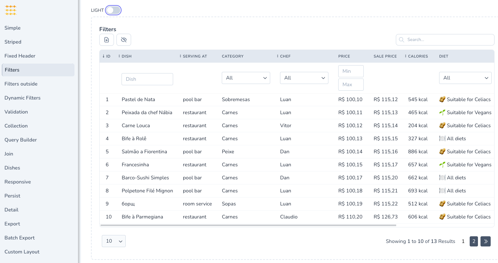
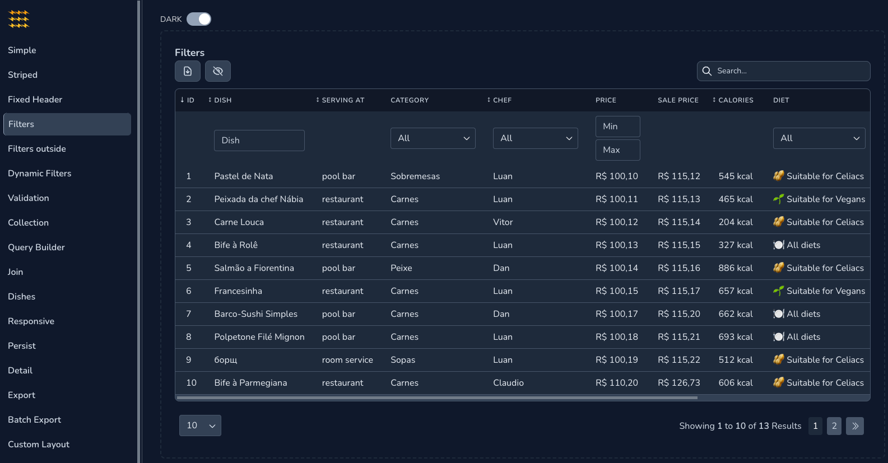

<div align="center">
	<p></p>
    <p align="center">
        <a href="https://packagist.org/packages/power-components/livewire-powergrid"></a>
        <a href="https://packagist.org/packages/power-components/livewire-powergrid"></a>
        <a href="https://github.com/Power-Components/livewire-powergrid/actions">
            
        </a>
        <a href="https://packagist.org/packages/power-components/livewire-powergrid"></a>
        <a href="https://packagist.org/packages/power-components/livewire-powergrid"></a>
    </p>
    <a href="https://livewire-powergrid.com" target="_blank">📚 Documentation</a> |
    <a href="#features">🔥 Features</a> |
    <a href="#get-started">⌨️ Get started</a>
</div>

------

# Livewire ⚡PowerGrid⚡

<br/>

PowerGrid creates modern, powerful and easy to customize Datatables based on Laravel [Livewire](https://laravel-livewire.com) library.

<br/>

➔  **Zero Configuration**: Tables have basic features activated by default.

➔  **It fits your needs**: Extend and customize your table including components (checkbox, action buttons, editable fields), global search feature, column data filters and data export tool.

➔  **Full Stubs**: Table components include feature examples. Just uncomment some code, enter your data, and it works!

<br/>

<p>
    
</p>

Dark mode:
<p>
    
</p>

<br/>

## 🚀 Instant Demo

### [Online Demo](https://demo.livewire-powergrid.com) (tailwind)

## Features

With PowerGrid you get right out of the box:

- **Filters & Search**

- **Column Sorting**

- **Column Sum, Count & Average in Header/Footer**

- **Pagination**

- **Action Checkboxes**

- **Action Buttons**

- **Bulk Actions**

- **Action Rules: Conditionally disable, hide and modify Action Buttons, Checkboxes and rows**

- **Toggle button**

- **Click to edit**

- **Responsive**

- **Link inside a table cell**

- **Livewire Modal Integration ([Wire Elements Modal](https://github.com/wire-elements/modal))**

- **Data Export to XLSX/CSV ([OpenSpout](https://github.com/openspout/openspout))**

- **Queue Export for large tables**

- **Works with Bootstrap 5 or Tailwind CSS 3x**

- **Translations available for 🇺🇸 🇧🇷 🇪🇸 🇮🇹 🇩🇪 and others...**

<br/>

 

------

# Get started

## 1. Requirements

- PHP 8.1+
- [Laravel 10+](https://laravel.com/docs/9.x/installation)
- [Livewire 3.0x](https://livewire.laravel.com)
- [Tailwind 3x](https://tailwindcss.com/docs/guides/laravel) or [Bootstrap 5](https://getbootstrap.com/docs/5.0/getting-started/introduction/)

<br/>

## 2. Install

```bash
composer require power-components/livewire-powergrid
```

Please follow the steps indicated in our [Documentation - Install](https://v4.livewire-powergrid.com/get-started/install.html) page.

<br/>

## 3. Support

For questions, issues, bug reports and feature requests, please use our [Issues](https://github.com/Power-Components/livewire-powergrid/issues).

Before submitting a new request, please look into our previous issues.

Verify if your bug/question or feature request has been previously submitted.

<br/>

## 4. How to contribute

We appreciate your interest in contributing with PowerGrid.

Please read the [Contributing Guide](https://github.com/Power-Components/livewire-powergrid/blob/main/CONTRIBUTING.md).

<br/>

## 5. Credits

Created by: [Luan Freitas](https://twitter.com/luanfreitasdev) and [@DanSysAnalyst](https://github.com/dansysanalyst)

- [Contributors](../../contributors)
- Logo & artwork by [Caneco](https://twitter.com/caneco)

<hr>

<p>Sponsored by:</p>
<p>
  <!--DevSquad-->
  <a href="https://devsquad.com" target="_blank">
    
  </a>
</p>

<p></p>
<p></p>

<p>Supported by:</p>
<p>
  <!-- PHPStorm -->
  <a href="https://www.jetbrains.com/phpstorm/" target="_blank">
    
  </a>
  <!-- Araxis Merge -->
  <a href="https://www.araxis.com/merge/" target="_blank">
    
  </a>
</p>

<hr>

<sup><b>Notice of Non-Affiliation and Disclaimer:</b> Livewire PowerGrid is not affiliated, associated, endorsed by, or in any way officially connected with the Laravel Livewire - copyright by Caleb Porzio.</sup>
