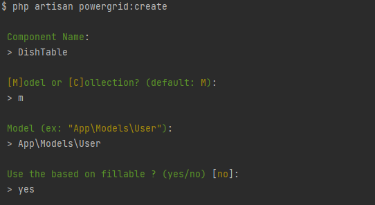
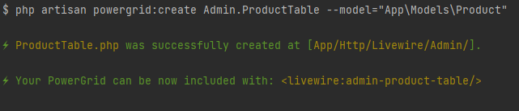

<div align="center">
	<p></p>
</p>
</div>

------

# Livewire PowerGrid

## What is Livewire PowerGrid?

[Livewire](https://laravel-livewire.com) PowerGrid is a component for  generating dynamic tables with your Laravel Models and Collections.

---
# Get started

- [Livewire PowerGrid](#livewire-powergrid)
  - [What is Livewire PowerGrid?](#what-is-livewire-powergrid)
- [Get started](#get-started)
  - [Requirements](#requirements)
  - [Installation](#installation)
    - [1. Via composer](#1-via-composer)
    - [2. Publish Config files](#2-publish-config-files)
    - [3. Publish files [OPTIONAL]](#3-publish-files-optional)
    - [4. Configure the theme and Alpine JS](#4-configure-the-theme-and-alpine-js)
    - [5. Include PowerGrid component](#5-include-powergrid-component)
    - [6. Creating a Table Component](#6--creating-a-table-component)
    - [6.1 Create with Fillable](#61-create-with-fillable)
    - [6.2 Create options](#62-create-options)
    - [7.  Using your Table Component](#7--using-your-table-component)
  - [Configuring and Customizing](#configuring-and-customizing)
    - [setUp() Method](#setup-method)
    - [dataSource() Method](#datasource-method)
      - [Column Settings](#column-settings)
      - [Column Filters](#column-filters)
      - [Column Actions](#column-actions)
    - [addColumns() Method](#addColumns-method)
    - [Action Methods](#action-methods)
      - [Open Modal](#1-openmodal)
      - [Event Listeners](#2-event-listeners)
    - [Update Method](#update-method)

---

## Requirements

- [Laravel 8x](https://laravel.com/docs/8.x/installation)
- [Livewire 2x](https://laravel-livewire.com)
- Tailwind or bootstrap:
    - [Install Tailwindcss](https://tailwindcss.com/docs/guides/laravel)
    - [Install Bootstrap 5](https://getbootstrap.com/docs/5.0/getting-started/introduction/)

## Installation

This documentation will describe the creation of a table called `DIshTable` used to list products of the `Product` Model.

### 1. Via composer

To install via composer, run:

```bash
  composer require power-components/livewire-powergrid
```

### 2. Publish Config files

Publish the Livewire PowerGrid configuration file with the following command:

```bash
  php artisan vendor:publish --tag=livewire-powergrid-config
```

### 3. Publish files [OPTIONAL] 

This step is OPTIONAL. Skip it if you don't need to customize Livewire PowerGrid.

Language files can be published with:

Views:

```bash
  php artisan vendor:publish --tag=livewire-powergrid-views
```

Language files can be published with:

```bash
  php artisan vendor:publish --tag=livewire-powergrid-lang
```

### 4. Configure the theme and Alpine JS

By default, PowerGrid uses Tailwind, Bootstrap 5 use.

#### 4.1 your blade layout add jquery before bootstrap.js:
```html
<script src="https://code.jquery.com/jquery-3.6.0.slim.min.js"></script>

<script src="https://cdn.jsdelivr.net/npm/bootstrap@5.0.1/dist/js/bootstrap.bundle.min.js" integrity="sha384-gtEjrD/SeCtmISkJkNUaaKMoLD0//ElJ19smozuHV6z3Iehds+3Ulb9Bn9Plx0x4" crossorigin="anonymous"></script>
        
<!-- after -->
@powerGridScripts
```

This configuration can be changed in the file `config/livewire-powergrid.php`.

#### 4.2 change config/livewire-powergrid.php:
```php
   //...
   'theme' => 'bootstrap'

```

For Tailwind:

```php
  //...
  'theme' => 'tailwind'

```

Alpine JS is not mandatory but it is required by features like "Click to edit" and "Toggable".

To activate it, open the file `config/livewire-powergrid.php` and modify the 'js_framework' setting replacing `null` with `'alpinejs'`.

```php
    //...
    'js_framework' => 'alpinejs',
```

The CDN for Alpine JS is  configured by default, in the same file:

```php
    //...
    'js_framework_cdn' => [
        'alpinejs' => 'https://cdn.jsdelivr.net/gh/alpinejs/alpine@v2.8.2/dist/alpine.min.js'
    ]
```

### 5. Include PowerGrid component

Include the Livewire and the PowerGrid styles and scripts:

```html
    <!-- Styles -->
    @livewireStyles
    @powerGridStyles

   </head>
```

```html
    <!-- Scripts -->
    @livewireScripts
    @powerGridScripts

</body>
```

You can read more about this at the official [Livewire documentation](https://laravel-livewire.com/docs/2.x/quickstart)

---

### 6.  Creating a Table Component

> To create a Table Component run `powergrid:create` and component will be assembled in steps using the question terminal:

Run command:

```bash
php artisan powergrid:create  
```

Fill in the questions:
```bash
Component Name:
> DishTable

[M]odel or [C]ollection? (default: M):
> DishTable

Model (ex: App\Models\User):
> App\Models\User

Use the based on fillable ? (yes/no) [no]:
> yes


```






(It's advisable to use "" around your `--model` option)

### 6.1 Create with Fillable 

If your Model has the fillable property specified, use `--fillable` option to create columns based on its value.

```bash
php artisan powergrid:create DIshTable --model="App\Models\Product" --fillable
```

If everything was successful, you will find your new table component inside the `app/Http/Livewire` folder.

### 6.2 Create options

 The command `powergrid:create` accepts the following options:

| Option | Description | Example |
|----|----|----|
|**--fillable**| Creates columns based on the Model's Fillable array | ```--fillable``` |
|**--template**| Uses a provided stub file as template for creating tables | ```--template=stubs/table_with_buttons.sub``` |

### 7.  Using your Table Component

The `DIshTable` component can be included in any view.

There are two ways to do that. Both work in the same way:

```html
    <livewire:dish-table/>
```

If your component lives is a sub-folder, for example Admin/DishTable.php:

```html
    <livewire:admin-dish-table/>
```

You can also use a blade directive:

```html
  @livewire('product-table')
```

---

## Configuring and Customizing

You can configure and customize your table component to adjust it to your needs.

You can view more functionalities consulting each of the following methods:

- [setUp()](#setup-method)
- [dataSource()](#datasource-method)
- [addColumns()](#addColumns-method)
- [Column Methods](#column-methods)
- [Action Methods](#action-methods)


### setUp() Method

The Setup method is used to configure your component.

| Method | Arguments | Description | Example |
|----|----|----|----|
|**showCheckBox**|-|Displays checkboxes on the table|`->showCheckBox()`|
|**showPerPage**|*Integer* $perPage|Items per page (Default 10) |`->showPerPage()`|
|**showSearchInput**|-|Shows the search input |`->showSearchInput()`|
|**showRecordCount**|*String* $mode (min\|short\|full)|Displays the records count|`->showRecordCount('short')`|
|**showExportOption**|*String* download filename, *Array* options|Displays export button|`->showExportOption('download', ['excel', 'csv])`|

Example of usage:

```php
  public function setUp()
  {
      $this->showCheckBox()
      ->showRecordCount('short')
      ->showPerPage()
      ->showSearchInput()
      ->showExportOption('download', ['excel', 'csv'], 'Export');
  }
```

### NOTE

NOTE: In this version some things will change:

dataSource can now receive an instance of an eloquent models or a collection treated with `PowerGrid::eloquent` within the method.

a method has been added to work with column mutation.

**_By default, powergrid will generate based on the eloquent model**_

### dataSource() Method

The `dataSource()` method is responsible for feeding data to your table.

It expects a model collection in the variable `$model`. Relationships can also be included.

#### model

```php
public function dataSource() {
    
     return Product::query()->with('group'); // without get()
    
}

```

#### collection

```php
public function dataSource() {

     return Product::query()->with('group')->get();
     
}
```

Here method is receiving all products with the relationship to groups.

For instance, the product "Mouse" belongs to "Computer" group,  the product "A4 Paper" belongs to "Office Supplies" group.

### addColumns() Method

| Method | Arguments | Description | Example |
|----|----|----|----|
|**addColumn**| *String* $title, *\Closure*  $closure|Database field for this column |`->addColumn('id')`|

Example of usage:

```php
public function addColumns(): ?PowerGrid
{
    return PowerGrid::eloquent()
        ->addColumn('id')
        ->addColumn('name')
        ->addColumn('size')
    
        /** Group Relationship **/
        ->addColumn('group_id', function (Product $product) {
            return  $product->group_id;
        })
        ->addColumn('group_name', function (Product $product) {
            return  $product->group->name;
        })
        /** Active Boolean **/
        ->addColumn('is_active')
        ->addColumn('is_active_label', function (Product $product) {
            return ($product->is_active ? "active" : "inactive");
        })
        /** Price Format **/
        ->addColumn('price')
        ->addColumn('price_formatted', function(Product $product) {
            return  '$ ' . number_format($product->price, 2, ',', '.');
        })
        /** Created Date Format **/
        ->addColumn('created_at')
        ->addColumn('created_at_formatted', function(Product $product) {
          return Carbon::parse($product->created_at)->format('d/m/Y H:i');
        });
}
```

The data of each column can be manipulated with a closure function.

```php
  ->addColumn('price') 
   //will output 1500.00
```

The example below brings the price formated.

```php
  ->addColumn('price_formatted', function(Product $product) {
      return  '$ ' . number_format($product->price, 2, ',', '.');
    })
    //will output $ 1.500,00
```

The custom currency format should be converted back in the updated method as demonstrated below.

The column `group_id` is added for the relationship filter and the column `group_name` will bring the group data via the relationship.

```php
    ->addColumn('group_id', function (Product $product) {
        return  $product->group_id;
    })
    ->addColumn('group_name', function (Product $product) {
        return  $product->group->name;
    })
```

---

#### Column Settings

These are the methods available on each column added with the `Column` class.

| Method | Arguments | Result | Example |
|----|----|----|----|
|**add**| |Add a new column |```Column::add()```|
|**field**| *String* $field | Field name| ```->field('name')```|
|**title**| *String* $title |Column title for the given field |```->title('Product Name')```|
|**searchable**| |Includes the column in the global search | ```->searchable()``` |
|**sortable**| |Includes column in the sortable list | ```->sortable()``` |
|**hidden**| |hides the column in the table|```->hidden()```|
|**headerAttribute**|[*String* $class default: ''], [*String* $style default: '']|Add the class and style elements to the column header|```->headerAttribute('text-center', 'color:red')```|
|**bodyAttribute**|[*String* $class default: ''], [*String* $style default: '']|Add the column lines the class and style elements|```->bodyAttribute('text-center', 'color:red')```|
|**visibleInExport**| |When true it will be invisible in the table and will show the column in the exported file|```->visibleInExport(true)```|

#### Column Filters

These are the filters available for each column.

| Method | Arguments | Result | Example |
|----|----|----|----|
|**makeInputText**| *String* $dataField | Renders a text field filter for the column|```->makeInputText()```|
|**makeBooleanFilter**|*String* $dataField, *String* $trueLabel, *String* $falseLabel|Filter for boolean columns|```->makeBooleanFilter('is_active', 'active', 'inactive')```|
|**makeInputDatePicker**| [*String* $class default: 'col-3'] |Include a specific field on the page to filter between the specific date in the column|```->makeInputDatePicker()```|
|**makeInputSelect**| [*Array* $data_source, *String* $display_field, *String* $relation_id, *Array* $settings] |Include a specific field on the page to filter a hasOne relation in the column|```->makeInputSelect(Group::all(), 'name', 'group_id', ['live_search' => true ,'class' => ''])```|
|**makeInputMultiSelect**| $data_source, *String* $display_field, *String* $relation_id |Include a specific field on the page to filter a hasOne relation in the column|```->makeInputSelect(Group::all(), 'name', 'group_id'])```|
|**makeInputRange**| [*string* $dataField, *String* $thousands, *String* $decimal] |Generates a min and max input for range filter.|```->makeInputRange('price', '.', ',')```|


#### Column Actions

These are the actions available for each column.

| Method | Arguments | Result | Example |
|----|----|----|----|
|**editOnClick**|*bool* $isEditable| Allows the column to be editable by clicking on it (*\*requires Alpine.js*) |```->field('name')->editOnClick()```|
|**toggleable**|*bool* $isTogglable, *String* $trueLabel, *String* $falseLabel| Renders a toggle control (ON/OFF) (*\*requires Alpine.js*) |```->field('is_active')->toggleable()```|
|**clickToCopy**|*bool* $hasPermission, *string* $label| Renders a button for copying the cell contents |```->field('name')->clickToCopy()```|

Example of usage:

The example below will render a column for the attribute name, with the title "Product Name". This column will be searchable by the main search field, will allow editing the values on click, and have its own input box filter on top.

```php
    $canEdit = true; // this role has permission to edit

    Column::add()
        ->title(__('Product Name'))
        ->field('name')
        ->searchable()
        ->editOnClick($canEdit)
        ->clickToCopy()
        ->makeInputText()
        ->sortable(),
```

The next example will bring a column with the date formatted and with a date filter for it.

```php
  Column::add()
      ->title('Creation date')
      ->field('created_at_formatted')  //Displays formatted data dd/mm/YYY to the user
      ->makeInputDatePicker('created_at') //Uses unformatted data
      ->searchable()
```

The example below renders a min-max amount filter and configures it to handle the custom currency formatting ($ 85.133,84). The method `makeInputRange` references the `price` attribute, while the column outputs the `price_formatted`.

```php
  Column::add()
      ->title(__('US Price'))
      ->field('price_formatted')
      ->makeInputRange('price', '.', ','),

```

Boolean column example:

```php
   $canEditStatus = true; // permission for editing
   
   Column::add()
      ->title(__('Status'))
      ->field('is_active')
      ->toggleable($canEditStatus, 'active', 'inactive') // Toggleable. If false, instead will render "active/inactive"
      ->makeBooleanFilter('is_active', 'active', 'inactive'), // Filter with "active/inactive" labels
```

**NOTE**

> Performing data updating with features like  clickToEdit and Toggleable will require you to have the [update()](#update-method) method uncommented and configured. [Alpine JS](#4-configure-the-theme-and-alpine-js) must be activated.

---

### Action Methods and Header Actions

If you want to add action buttons to each row of the table you can use the `actions` method.

These methods are available in the `Button` class.

> You can also use the `Button` class methods to add buttons beside the export button by calling a new `header` method instead of `actions`()

| Method | Arguments | Result | Example |
|----|----|----|----|
|**add**| *String* $action |Action name |```Button::add()```|
|**caption**| *String* $caption |Label for the button |```->caption('Edit Product')```|
|**class**| *String* $class_attr |CSS class attribute |```->class('bg-indigo-500 text-white')```|
|**emit**| *String* $event, *Array* $params| |```->event('eventName', ['product' => 'id'])```|
|**openModal**| *String* $component, *Array* $params| |```->openModal('product', ['product' => 'id'])```|
|**method**| *String* $method|Method for action (GET/POST/PUT/DELETE))|```->method('delete')```|
|**route**| *String* $route, *Array*  $param|Route for action|```->route('product.edit', ['product' => 'id'])```|

Example of usage in action:

```php
public function actions(): array
{
     return [
        Button::add('destroy')
            ->caption(__('Delete'))
            ->class('bg-red-500 text-white')
            ->route('product.destroy', ['product' => 'id'])
            ->method('delete'),
        //...
     ];
}

public function header(): array
{
     return [
        Button::add('new')
            ->caption(__('__New'))
            ->class('')
            ->openModal('new', []),
        //...
     ];
}
  ```

  ---
#### 1. OpenModal

You will need to install the component [Livewire UI Component](https://github.com/livewire-ui/modal)  

* the first argument is within the openModal method is the name of the modal component

* the second argument is an array of parameters where the key is field name in the modal component and the second is the name of the model field of this component

```php
 return [
    Button::add('view')
        ->caption(__('View'))
        ->class('btn btn-primary')
        ->openModal('product', ['cod' => 'id']),
  //...
];
  ```

#### 2. Event listeners

[Livewire Events](https://laravel-livewire.com/docs/2.x/events)

* the first argument is inside the event method is the name of the event listeners

* the second argument is an array of parameters that the event will receive.

for example:
If you want to do something like this on livewire:

```html
<button wire:click="$emit('postAdded', ['key' => 1])">
```

```php
 return [
    Button::add('view')
        ->caption(__('View'))
        ->class('btn btn-primary')
        ->emit('postAdded', ['cod' => 'id']),
  //...
];
  ```

  ---
  
### Update Method

> The update method needs to be activated and configured for the edit on click and toggle to work.

All data sent by the user should go under validation and treatment. For instance, the user sends `price_formatted` with the value of `$ 4.947,70` to update the `Product` `price`. The database has the field `price` and expects `44947.70`. The developer must handle this data and point where to save it. Powergrid will not perform this conversion automatically.
The same would happen with dates. See the two basic examples below:


```php
public function update(array $product): bool
{

        /**
        * Reverts "price_formatted" to the database format and saves in the 'price' field.
        *  $ 4.947,70 --> 44947.70
        **/

        if ($data['field'] == 'price_formatted') {
              $data['field'] = 'price'; //Update the field price
              $data['value'] = Str::of($data['value'])
                ->replace('.', '')
                ->replace(',', '.')
                ->replaceMatches('/[^Z0-9\.]/', '');
        }

        /**
        *  Parses the date from d/m.Y (25/05/2021) 
        **/
         if ($data['field'] == 'created_at_formatted' && $data['value'] != '') {
            $data['field'] = 'created_at'; // Updates created_at
            $data['value'] =  Carbon::createFromFormat('d/m/Y', $data['value']);
         }

      try {
          $updated = Product::query()->find($product['id'])->update([
              $product['field'] => $product['value']
          ]);
      } catch (QueryException $exception) {
          $updated = false;
      }
      return $updated;
}
```

The `update()` method supports custom messages for each field.

To modify the displayed message after saving data, edit or add items on the `updateMessages()` method.

```php
    public function updateMessages(string $status, string $field = '_default_message'): string
    {
        $updateMessages = [
            'success'   => [
              '_default_message' => __('Data has been updated successfully!'),
               //...
              'name' => __('Product name updated successfully!'), // Custom message for name field
              ],

            "error" => [
              '_default_message' => __('Error updating the data.'),
               //'custom_field' => __('Error updating custom field.'),
            ]

        ];

        return ($updateMessages[$status][$field] ?? $updateMessages[$status]['_default_message']);
    }
```
